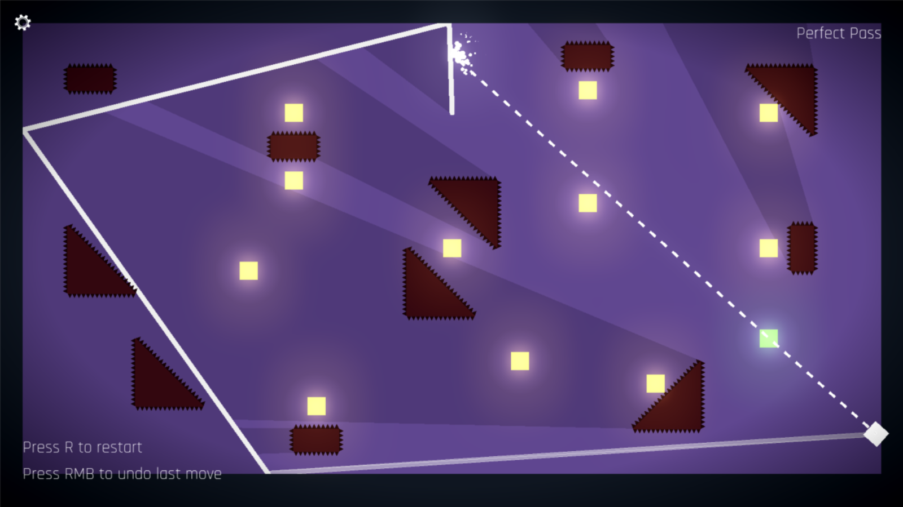
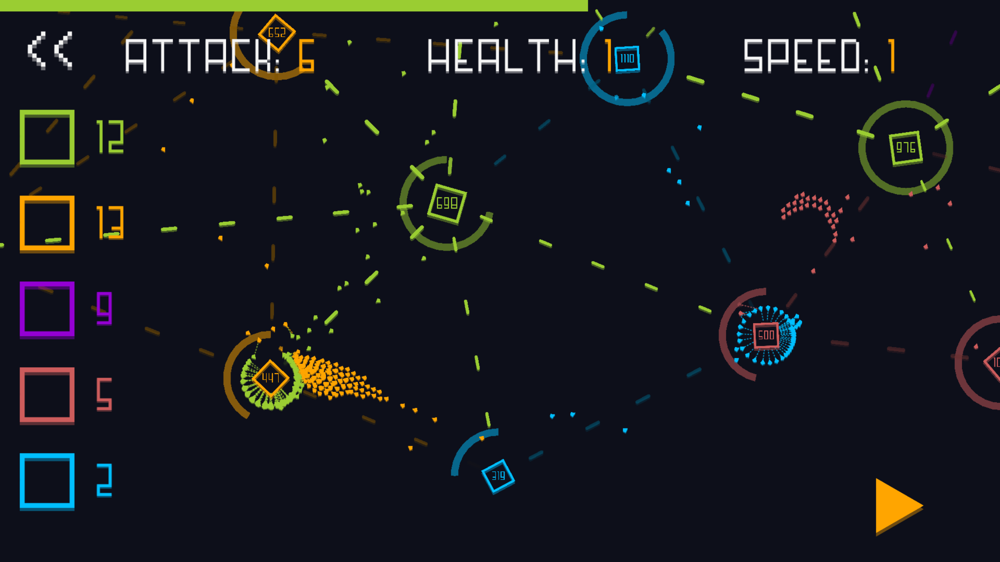
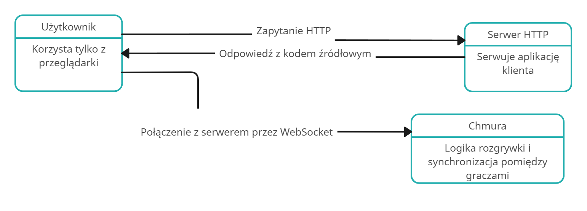
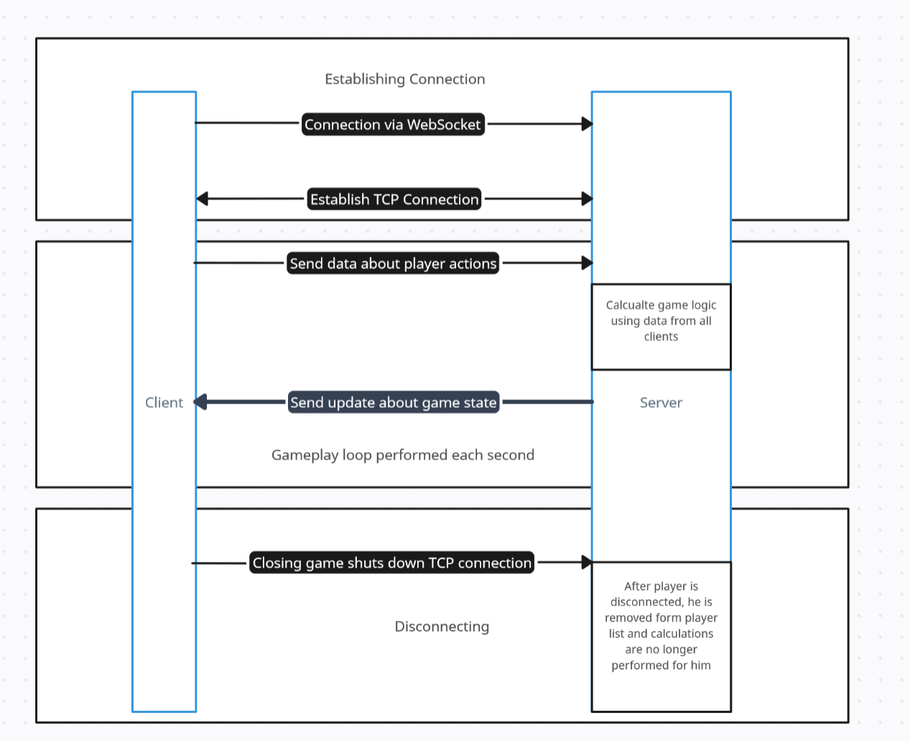

# Macierz Kompetencji Zespołu

Kompetencje|Dominik Dziechciarz|Paweł Kępowicz
-|-|-
Programowanie GDScript|Posiada|Posiada
Networking|Nie posiada|Posiada (podstawy)
Game Design|Posiada (podstawy)|Posiada
Umiejętności graficzne|Nie posiada|Nie posiada
Testowanie Oprogramowania|Nie posiada|Nie posiada
System Design|Posiada (podstawy)|Posiada (podstawy)
Oracle cloud|Posiada (podstawy)|Posiada (podstawy)
# Pytania odnośnie projektu
Pytanie|Odpowiedź|Uwagi
-|-|-
Ile trwa rozgrywka?|5 minut na rundę| -
Jak gracz włącza grę?|Poprzez wejście na odpowiedni adres w przeglądarce| -
Czy coś pomiędzy rozgrywkami będzie się zapisywać | Nie, każda rozgrywka jest niezależna od pozostałych | -
Czy użytkownicy będą mieć swoje konta| Nie, chcemy wymagać od użytkownika jak najmniej | -
Czy gra będzie płatna?|Nie, będzie całkowicie darmowa| -

# Założenia gry
## Grafika
 Gra 2D typu top down z minimalistyczną grafiką. Przykład:
 [Long Tail](https://rkamil.itch.io/long-tail)
 [ICE](https://play.google.com/store/apps/details?id=com.queader.ice&hl=en&pli=1)
 
## Rozgrywka
 Główną inspiracją przy tworzeniu gry jest Quake 2 i Super Smash Bros. Zasady mają być proste, do zrozumienia w czasie pierwszych 10 minut rozgrywki. Gracz ma możliwość poruszania się swoją postacią, podstawowego ataku i możliwość podnoszenia zaawansowanych broni. Każda zadaje określoną liczbę punktów obrażeń i odpycha trafiony cel. Rozgrywka powinna być szybka, a system podnoszenia silniejszych broni ma zmuszać graczy do agresywnych zagrań w duchu Quake'a. Walka toczy się na ograniczonym terenie i najskuteczniejszym sposobem eliminacji powinno być wypchnięcie przeciwnika z areny. 
## Rywalizacja
 Gracze rywalizują w meczach trwających około 5 minut. Zwycięzcą danej rundy zostaje gracz który zdobył najwięcej eliminacji. Po zakończeniu meczu jest krótka przerwa z podsumowaniem i automatycznie rozpoczyna się nowa gra.
# Projekt architektury opracowanego systemu

Założeniem jest udostępnienie użytkownikowi płynnej rozgrywki w oknie przeglądarki bez potrzeby instalacji nowych plików. Będzie musiał wejść pod odpowiedni adres URL, wtedy jego przeglądarka załaduje aplikacje która pozwoli z odpowiedniego interfejsu graficznego połączyć się z serwerami na których będzie toczyć się rywalizacja.

# Sugerowane rozwiązania
### Silnik gry: Godot
 Uzasadnienie: Członkowie zespołu posiadają doświadczenie w tworzeniu gier z wykorzystaniem tego silnika, dodatkowo Godot posiada opcje wysokopoziomowej obsługi połączeń i synchronizacji rozgrywki co znacznie ułatwi prace nad projektem. Umożliwia on eksportowanie projektu za pomocą WebGL co pozwoli na wykorzystanie przeglądarki do rozgrywki
### Serwer HTTP: Github pages i/lub itch.io
 Uzasadnienie: Do hostingu aplikacji klienta wystarczy udostępnienie statycznej strony, dlatego Github pages jest darmowym i prostym rozwiązaniem. Dodatkowo udostępnienie projektu w serwisie gdzie gromadzą się fani gier indie takim jak itch.io pozwoli na zdobycie większej popularności i zgromadzenie większego feedbacku.
### Chmura: Oracle cloud
 Uzasadnienie: Wszyscy członkowie zespołu są zaznajomieni z chmurą Oracle która oferuje wszystkie opcje potrzebne do zrealizowania projektu za darmo.
### Diagram Sekwencji

